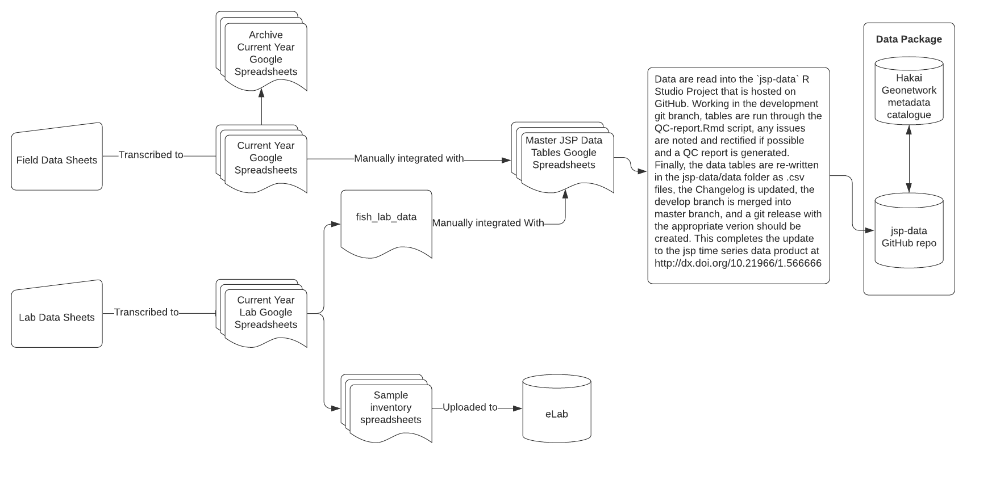

# jsp-data

Welcome to [Hakai Institute](www.hakai.org) Juvenile Salmon Program data repository.

This repository is public and so the data and code are liberally licensed under [Creative Commons By Attribution 4.0 (CC BY4)](https://creativecommons.org/licenses/by/4.0/) license. Download the data files you'd like or clone this Git repository and copy the data to your computer but you must attribute the work to the authors. To cite this work please see http://dx.doi.org/10.21966/1.566666 Please collaborate with the authors of this dataset if you plan to analyze it. They represent a significant public resource, and time investment.

# What's in the repository?

## Data folder
In the data folder you will find all the individual tables of data that are collected both in the field and in the lab. Each year data are initially stored in a google sheet specific to the collection year and after they are QA/QC'd they are added to the Master JSP Data Tables googlesheet. Each table from the Master JSP Data Tables googlesheet is then downloaded as a .csv to the data folder of this repository. These tables each fit one and other in a relational database format. UFN (universal fish number) joins fish samples and results to fish, seine_id connects fish to seines, and survey_id connects seines to surveys. These tables need significant processing, filtering, and joining before the make much sense and before inter-annual comparisons can be made.

## Scripts
The data_wrangle script processes and joins the individual tables in the data folder so that annual comparisons can be made under the same assumptions and field methods.

The Migration_Observations_Report.rmd reads in the data processed by the data_wrangle script, calculates statistics, produces figures, tables, and is where the report text can be written and compiled into a pdf report. The filtered and processed data that is used for interannual comparisons can be found in the processed_data folder.

