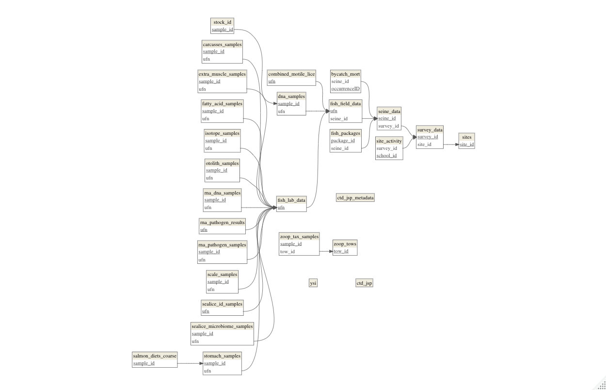

# jsp-data

Welcome to [Hakai Institute](www.hakai.org) Juvenile Salmon Program data repository.

# What's in the repository?

## Data folders

### raw_data

In the raw_data folder you will find all the individual tables of data that are collected both in the field and in the lab as well as sample inventory files and sample results. While this folder is called 'raw_data' it has already had significant QA/QC conducted on it through data validation and conditional formatting in our google sheets. Each year data are initially stored in a google sheet specific to the collection year and after they are QA/QC'd they are added to the Master JSP Data Tables googlesheet. Each table from the Master JSP Data Tables googlesheet is then downloaded as a .csv to the raw_data folder of this repository. Similarly, when sample results are received from external labs or students some processing is done in google sheets to ensure data quality and that the data can be joined with the  appropriate fish. Many of these initial steps and original data files are stored in the Hakai Juvenile Salmon Program Team Drive and can be accessed there should any errors in the raw_data be documented. Tables in the raw_data folder often are structured for ease of data entry and need significant transformation (via the data-integration-and-QC.Rmd script) before joining the relational data model. Also significant processing, filtering, and joining is required before inter-annual comparisons can be made between these data due to variations in the field  and lab protocols each year.

### tidy_data

Data in the tidy_data folder are what we consider the fully QC'd relational database consisting of a number of .csv files that join together in a relational data model. The data in this folder have been transformed and quality checked by the data-integration-and-QC.Rmd script. These data include every observation that has been made in each year, all sample inventory data (excluding physical location which is stored in our Laboratory Information Management system - eLab). Data in the tidy_data folder are filtered down to sites and sampling time periods and sampling methods that allow for inter annual comparison in the annual report.  Data in the tidy_data folder are also transformed to the Ocean  Biodiversity Information System format.

There are a number of data tables that come together to form a relational data model. The figure below details how each table is joined together via primary and foreign keys. 

### report_data

These data are a subset of data from the the tidy_data folder that have been filtered to permit inter annual  comparisons which accomplished in the annual_report_data_wrangle.Rmd script. The folder contains a number of tables that are what we consider our 'time series'. These tables are formatted for ease of producing plots and pretty tables for the report. The Migration_Observations_Report.Rmd script reads data from the report_data folder to produce  a pdf annual report with our time series figures, statistics, and tables. This report is submitted annually to the NPAFC.

### OBIS_data

A subset of the data in this folder have been transformed (via the JSP-OBIS-transform.Rmd script) from the tables in the tidy_data folder to the [Darwin Core OBIS Env Data Format](https://obis.org/manual/dataformat/). The focus for this dataset is on species occurrences and any related measurements or facts that are associated with species occurrences. Some environmental data is also included. We upload this data to the Ocean Biodiversity Information System via the Global Biodiversity Information System's Integrated Publishing Toolkit. This allows the data to be interoperable with other data global datasets.

## Scripts

The data_integration_and_QC.Rmd script performs various quality checks and integrates the data in the raw_data folder into the relational data model. 

The historic_sealice_integration.R script joins together various sources of sealice data that were collected under different protocols. The script integrates all the various sources of sealice data in the raw_data folder into the sealice_lab_mots_simple.csv file that makes the data comparable between years and methods of sealice identification.

The annual_report_data_wrangle.Rmd script processes and joins the individual tables in the data folder so that annual comparisons can be made under the same assumptions and field methods.

The Migration_Observations_Report.rmd reads in the data processed by the data_wrangle script, calculates statistics, produces figures, tables, and is where the report text can be written and compiled into a pdf report. The filtered and processed data that is used for interannual comparisons can be found in the processed_data folder.

# Other files

## CHANGELOG

Here we track what changes between different versions of the dataset. Different versions of the data set will be tagged on github with a release tag showing the version (eg. v1.2.0) that should  be cited when using these data to be clear which version of the data you used  for an analysis.

## Data dictionary

In the data dictionary we aim to provide  definitions of all the core tables. Definitions of variables in sample result data may have there own separate data dictionary  or readme file in  the raw_data folder and sub folders.

## License

This repository is public and so the data and code are licensed under the [Creative Commons By Attribution 4.0 (CC BY4)](https://creativecommons.org/licenses/by/4.0/) license. Download the data files you'd like or clone this Git repository and copy the data to your computer but you must attribute the work to the authors. To cite this work please see http://dx.doi.org/10.21966/1.566666 Please collaborate with the authors of this dataset if you plan to analyze it. They represent a significant public resource, and time investment.